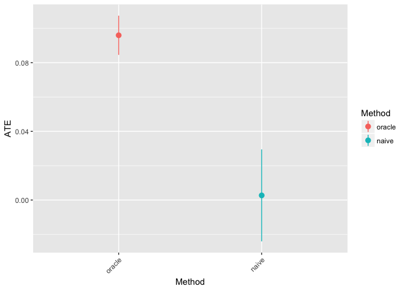
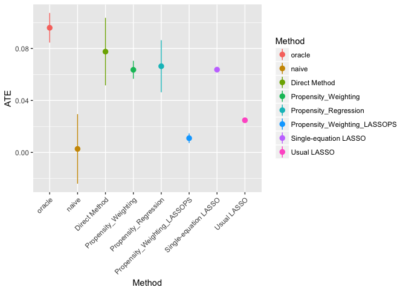
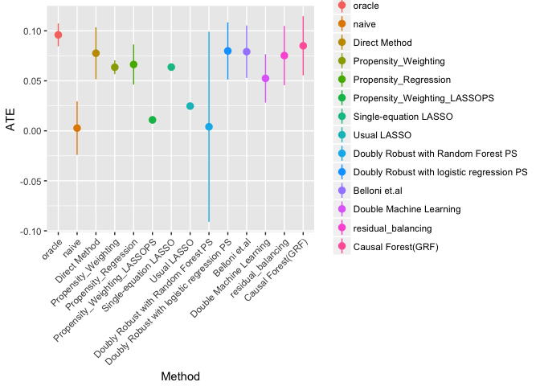

AEA Annual Meeting 2018 Tutorial Replication
================
Shota Yasui
4/23/2018

About this document
-------------------

This document is the replication of [this R tutorial](https://drive.google.com/open?id=1JS223q7LKHciEnysrBGzfD6uWk5_xlgz) in Machine Learning and Econometrics tutorial in AEA Annual Meeting 2018. In addition to the original implementation, I added standard error to the result.

read some packages and some functions
-------------------------------------

``` r
library(tidyverse)
library(glmnet)
library(randomForest)
library(balanceHD)
library(grf)
source("ate_functions.R")
```

Read data
---------

You can download the data from [here](https://github.com/gsbDBI/ExperimentData/blob/master/Social/ProcessedData/socialpresswgeooneperhh_NEIGH.csv), which is publicly available on [this repository](https://github.com/gsbDBI/ExperimentData/tree/master/Social).

``` r
data_raw <- read.csv("socialpresswgeooneperhh_NEIGH.csv")
```

Prepare Dataset
---------------

This part is just copied from the original document. The order of code is slightly differenct.

### Set seed and number of observation

``` r
set.seed(1991)
n_obs <- 50000
```

### These are the covariates we'll use

``` r
cts_variables_names <- c("yob", "city", "hh_size", "totalpopulation_estimate",
                         "percent_male", "median_age",
                         "percent_62yearsandover",
                         "percent_white", "percent_black",
                         "percent_asian", "median_income",
                         "employ_20to64", "highschool", "bach_orhigher",
                         "percent_hispanicorlatino")
binary_variables_names <- c("sex","g2000", "g2002", "p2000", "p2002", "p2004")
covariates <- c(cts_variables_names, binary_variables_names)
all_variables_names <- c(covariates, "outcome_voted", "treat_neighbors")
```

### Scaling

``` r
# Selecting only desired covariates
data_subset <- data_raw %>%
  sample_n(size = n_obs) %>%
  dplyr::select(all_variables_names)


# Extracting and scaling continuous variables
scaled_cts_covariates <- data_subset %>%
  dplyr::select(cts_variables_names) %>%
  scale()

# Extracting indicator variables
binary_covariates <- data_subset %>%
  dplyr::select(binary_variables_names)

# Extracting outcome and treatment
outcome <- data_subset %>% dplyr::select(outcome_voted)
treatment <- data_subset %>% dplyr::select(treat_neighbors)
```

### Setting up the data, renaming columns and discarding rows with NA (if any)

``` r
df <- data.frame(scaled_cts_covariates, binary_covariates, outcome, treatment) %>%
  plyr::rename(c(treat_neighbors = "W",
                 outcome_voted = "Y")) %>%
  na.omit()
```

### Introduce sampling bias

``` r
#introduce sampling bias
pt <- .85 # Drop p% of voters who satisfy the following condition
pc <- .85

# These individuals are likely TO GO voting: drop from TREATMENT
drop_from_treat <-  (df[,"g2000"]==1 | df[,"g2002"]==1) |
  (df[,"p2000"]==1 | df[,"p2002"]==1 | df[,"p2002"] == 1) |
  (df[,"city"] > 2) | (df[,"yob"] > 2)

# These individuals are likely NOT TO GO voting: drop from CONTROL
drop_from_control <-(df[,"g2000"]==0 | df[,"g2002"] == 0) |
  (df[,"p2000"]==0 | df[,"p2002"]==0 | df[,"p2004"]==0) |
  (df[,"city"] < -2 | df[,"yob"] < -2) 


drop_treat_idx <- which(df[,"W"] == 1 & drop_from_treat)
drop_control_idx <- which(df[,"W"] == 0 & drop_from_control)

drop_idx <- unique(c(drop_treat_idx[1:round(pt*length(drop_treat_idx))],
                     drop_control_idx[1:round(pc*length(drop_control_idx))]))

print(length(drop_idx))
```

    ## [1] 41062

``` r
df_mod <- df[-drop_idx,]
```

As we see people who voted before were droppoed from treatment group and people who did not vote before were dropped, the scinario of this sampling bias is the treatment was assigned to people less likely to vote.

RCT result as oracle
--------------------

``` r
result_df <- data.frame()
ate_oracle <- naive_ate(dataset = df, treatment_var = "W", outcome_var = "Y", method = "oracle")

result_df <- result_df %>% rbind(ate_oracle)
```

The result of RCT is the best result what we are able to obtain from this dataset. Therefore, the main interest of this document is what method can produce the closest result with RCT in this dataset.

Naive Method
------------

``` r
naive_ate <- naive_ate(dataset = df_mod, treatment_var = "W", outcome_var = "Y")
result_df <- result_df %>% rbind(naive_ate)
```

This is the easiest way to estimate the effect of W. This result is correct if the W is randomly assigned. However, the current data set is not in such case.

RCT vs Naive
------------

``` r
ggplot(result_df, aes(y = ATE, x = Method, color = Method)) + 
  geom_pointrange(aes(ymax = upper_ci, ymin = lower_ci)) + 
  theme(axis.text.x = element_text(angle = 45, hjust = 1))
```

 The result of Naive is far away from the result of RCT. This gap is made by sampling bias. Since W is assigned to people who less likely to go to vote, so that the effect of W offset such sampling bias effect. As a result we observed zero effect by Naive approach.

OLS
---

``` r
tauhat_lm <- ate_condmean_ols(df_mod, treatment_var = "W", outcome_var = "Y")
result_df <- result_df %>% rbind(tauhat_lm)
```

Now we try to control some covariate which may produce the sampling bias.

Propensity Score
----------------

### Weighting

``` r
# Computing the propensity score by logistic regression of W on X.
p_logistic <- df_mod %>% 
  dplyr::select(covariates, W) %>%   
  glm(W ~ ., data = ., family = binomial(link = "logit")) %>%   
  predict(type= "response")

tauhat_psw <- prop_score_weight(dataset = df_mod, p = p_logistic, treatment_var = "W", outcome_var = "Y")
result_df <- result_df %>% rbind(tauhat_psw)
```

### Regression

``` r
tauhat_psols <- prop_score_ols(dataset = df_mod, p = p_logistic, treatment_var = "W", outcome_var = "Y")
result_df <- result_df %>% rbind(tauhat_psols)
```

### Propensity Score by LASSO then weighting

``` r
p_lasso <- prop_score_lasso(df_mod, treatment_var = "W")
tauhat_ps_lasso <- prop_score_weight(dataset = df_mod, 
                                       p = p_lasso[,1], 
                                       treatment_var = "W", 
                                       outcome_var = "Y",
                                       method = "Propensity_Weighting_LASSOPS")

result_df <- result_df %>% rbind(tauhat_ps_lasso)
```

LASSO application
-----------------

### Single equation LASSO

``` r
tauhat_lasso_seq <- ate_condmean_lasso(df_mod, treatment_var = "W", outcome_var = "Y")

result_df <- result_df %>% rbind(tauhat_lasso_seq)
```

### Usual LASSO

``` r
tauhat_lasso_all <- ate_lasso(df_mod, treatment_var = "W", outcome_var = "Y")

result_df <- result_df %>% rbind(tauhat_lasso_all)
```

Compare Regression Extentions
-----------------------------

``` r
ggplot(result_df, aes(y = ATE, x = Method, color = Method)) + 
  geom_pointrange(aes(ymax = upper_ci, ymin = lower_ci)) + 
  theme(axis.text.x = element_text(angle = 45, hjust = 1))
```



Doubly Robust
-------------

``` r
tauhat_doubly <- doubly_robust(df_mod, treatment_var = "W", outcome_var = "Y", 2500)
tauhat_doubly_glm <- doubly_robust_glm(df_mod, treatment_var = "W", outcome_var = "Y")

result_df <- result_df %>% rbind(tauhat_doubly, tauhat_doubly_glm)
```

Belloni et.al(2013)
-------------------

``` r
tauhat_belloni <- belloni(df_mod, treatment_var = "W", outcome_var = "Y")

result_df <- result_df %>% rbind(tauhat_belloni)
```

Doubly Machine Learning
-----------------------

``` r
tauhat_double_ml <- double_ml(df_mod, treatment_var = "W", outcome_var = "Y", num_tree = 2000)

result_df <- result_df %>% rbind(tauhat_double_ml)
```

Approximate Residual Balancing
------------------------------

``` r
tauhat_balancdHD <- residual_balance_ATE(dataset, 
                                         treatment_var = "W", 
                                         outcome_var = "Y", 
                                         optimizer = "pogs")

result_df <- result_df %>% rbind(tauhat_balancdHD)
```

causal forest
-------------

``` r
forest <- grf::causal_forest(X=as.matrix(df_mod[,covariates]),
                             Y=as.matrix(df_mod[,"Y"]),
                             W=as.matrix(df_mod[,"W"]), 
                             num.trees = 2000,
                             honesty=TRUE,
                             seed=12345)


# Incorrect way to derive ATE and its standard errors
pred <- predict(forest, estimate.variance = TRUE)
ate_bad <- mean(pred$predictions)
se_bad <- sqrt(mean(pred$variance.estimates))
cat(sprintf("Incorrect ATE: %1.3f (SE: %1.3f)", ate_bad, se_bad))
```

    ## Incorrect ATE: 0.083 (SE: 0.198)

``` r
# Doubly-robust ATE 
ate_cf_robust <- grf::estimate_average_effect(forest)

tauhat_cf <- data.frame(Method = "Causal Forest(GRF)", 
                        ATE = ate_cf_robust["estimate"], 
                        lower_ci = ate_cf_robust["estimate"] - (ate_cf_robust["std.err"]*1.96),
                        upper_ci = ate_cf_robust["estimate"] + (ate_cf_robust["std.err"]*1.96))

result_df <- result_df %>% rbind(tauhat_cf)
```

Compare CausalML Methods
------------------------

``` r
ggplot(result_df, aes(y = ATE, x = Method, color = Method)) + 
  geom_pointrange(aes(ymax = upper_ci, ymin = lower_ci)) + 
  theme(axis.text.x = element_text(angle = 45, hjust = 1))
```


